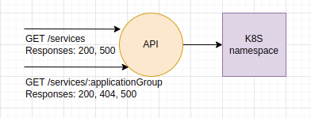

## Platform Manager

## Table of Contents

- [Goals](#goals)
- [Architecture](#architecture)
- [Application Architecture](#application-architecture)
- [Testing Strategy](#testing-strategy)
- [Setup](#setup)
  - [Requirements](#Requirements)
  - [Run](#Run)
- [Quality code](#quality-code)
  - [Testing](#testing)
  - [Linting](#linting)
- [Documentation](#documentation)

### Goal 

The team SRE Platform has created a Kubernetes cluster and the first few services have been deployed to it. Now it is
time to expose some information on the current state of each service.

#### Tasks

For any of the following tasks please use git to track the status and progress of your development and include the git repository (.git/) in the upload.

You can choose whatever programming language you feel most comfortable with. Please include instructions on how to build and run the
application.

You will need the following:

- [`kubectl`](https://kubernetes.io/docs/tasks/tools/install-kubectl/)
- A Kubernetes Cluster, created e.g. via [kind](https://kind.sigs.k8s.io/), [minikube](https://kubernetes.io/docs/setup/minikube/) or [Docker for Mac](https://docs.docker.com/docker-for-mac/kubernetes/).

Please apply the services to your local Kubernetes cluster by executing `kubectl apply -f ./services.yaml`.

#### 1. Expose information on all pods in the cluster

Add an endpoint to the service that exposes all pods running in the cluster in namespace `default`:

```
GET `/services`
[
  {
    "name": "first",
    "applicationGroup": "alpha",
    "runningPodsCount": 2
  },
  {
    "name": "second",
    "applicationGroup": "beta",
    "runningPodsCount": 1
  },
  ...
]
```

#### 2. Expose information on a group of applications in the cluster

Create an endpoint in your service that exposes the pods in the cluster in namespace `default` that are part of the same `applicationGroup`:

```
GET `/services/{applicationGroup}`
[
  {
    "name": "foobar",
    "applicationGroup": "<applicationGroup>",
    "runningPodsCount": 1
  },
  ...
]
```

### Implementation

This is an HTTP server that retrieves K8S cluster information. The result can be retrieved through 2 HTTP endpoints. As for maintainability, it thrives to follow a simplified version of the [Onion architecture principles](https://www.thinktocode.com/2018/08/16/onion-architecture/).

### Architecture



### Application architecture

- `./cmd` holds the application main entry point,
- `./config` holds application configuration,
- `./docs` holds swagger documentation,
- `./internal` holds application specific logic,
- `./pkg` holds generic logic that could be externalized in a common library repository.

The implementation is based on the inversion of control principle. [The application is decoupled in layers](https://www.codeguru.com/csharp/understanding-onion-architecture/). In our case, as the application is pretty simple, the architecture follows the following layers: `Handler (http) => Service (k8sclient) => Domain (service)`. Layers are connected through interfaces which makes testing easier. Furthermore all external dependencies are represented in external layers. It is a flexible, sustainable, and portable architecture. 

### Testing Strategy

Ideally, I would want to follow the [Test Pyramid stragegy](https://martinfowler.com/articles/practical-test-pyramid.html).

- On unit tests: we reach an overall coverage of 88,9%. Critical contracts are made to interfaces and not to concrete implementations. It allows us to mock concrete implementations from interfaces using [gomock library](https://github.com/golang/mock).
- On integration tests: there are none, even though unit tests cover the repository layer. Ideally, I would have liked a few integration tests on the k8s client.
- On e2e tests, you can run the below queries when running the stack: 

You can run the following tests

```
GET `/services`
[
    {
        "name": "blissful-goodall-deployment",
        "applicationGroup": "beta",
        "runningPodsCount": 1
    },
    {
        "name": "confident-cartwright-deployment",
        "applicationGroup": "beta",
        "runningPodsCount": 1
    },
    {
        "name": "happy-colden-deployment",
        "applicationGroup": "",
        "runningPodsCount": 1
    },
    {
        "name": "quirky-raman-deployment",
        "applicationGroup": "gamma",
        "runningPodsCount": 1
    },
    {
        "name": "stoic-sammet-deployment",
        "applicationGroup": "alpha",
        "runningPodsCount": 2
    },
    {
        "name": "coredns",
        "applicationGroup": "",
        "runningPodsCount": 2
    },
    {
        "name": "local-path-provisioner",
        "applicationGroup": "",
        "runningPodsCount": 1
    }
]
```

```
GET `/services/beta`
[
    {
        "name": "blissful-goodall-deployment",
        "applicationGroup": "beta",
        "runningPodsCount": 1
    },
    {
        "name": "confident-cartwright-deployment",
        "applicationGroup": "beta",
        "runningPodsCount": 1
    }
]
```

## Setup

### Requirements

- Golang (check minimum required version in the [go.mod file](./driver-location/go.mod))
- Docker >= 20.10.12
- Kind via https://kind.sigs.k8s.io/. If you use minikube, you will encounter TLS certification errors as in the current solution certificates are not made available inside the Docker container of the running service. For convenience, please look at the used [kubeconfig](./sample.kubeconfig.yaml) 

### Run

They are two mode to run the service:

- default mode
- development mode

`make up` to start the stack with all necessary services to run the service.

`make dev` should be equivalent to the default mode with a hot reload system in addition, useful for development purposes.

### Local services

You can access to your local service with the following ports:

- **HTTP API:** 3000

## Quality code

You need to run `make tools` to install the different tools needed for testing, linting ...

### Testing

`make test` to execute unit tests.

For each feature you add to the project, the unit tests will have to be provided.

You can check the code coverage of the project by running this commands:

- `make cover`
- `make cover-html`

### Linting

We use [Golangci-lint](https://golangci-lint.run/) as linter.

`make lint` to execute linting.

**Note**: The linter is not executed on the test files.

## Documentation

We use swaggo to generate a swagger documentation. To install swaggo, run `make tools`, and to generate the documentation run `make docs`.

The documentation will then be available under the endpoint [/swagger/index.html](http://localhost:3000/swagger/index.html).


